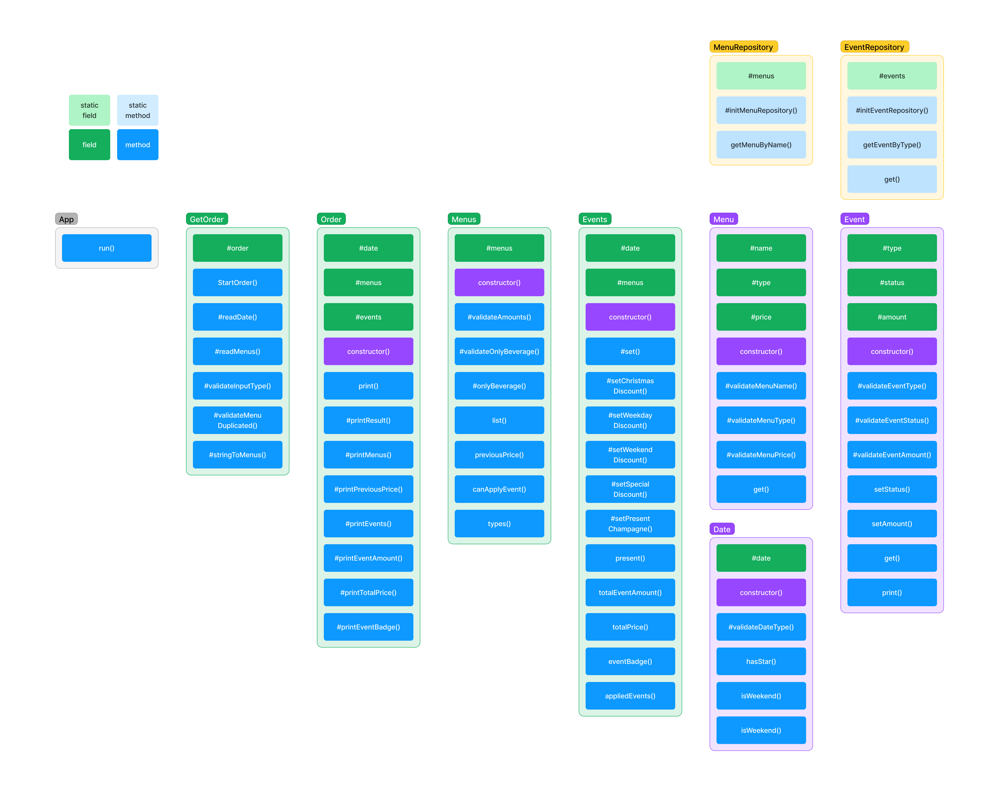

# 미션 - 크리스마스 프로모션

- [프로젝트 설명](./README.md#📋-프로젝트-설명)
- [Domain](./README.md#📱-domain)
  - [GetOrder](./README.md#getorder---날짜-및-메뉴-입력받기)
  - [Menus](./README.md#menus---메뉴들의-기본-정보-계산-및-반환)
  - [Events](./README.md#events---이벤트에-대한-정보-계산-및-반환)
  - [Order](./README.md#order---메뉴들과-이벤트에-대한-정보-반환)
- [Model](./README.md#🛢️-model)
  - [Date](./README.md#date---날짜에-대한-정보-반환)
  - [Menu](./README.md#menu---메뉴에-대한-정보-반환)
  - [Event](./README.md#event---이벤트에-대한-정보-반환)
- [Repository](./README.md#💾-repository)
  - [MenuRepository](./README.md#menurepository---주어진-메뉴-정보-저장)
  - [EventRepository](./README.md#eventrepository---주어진-이벤트-정보-저장)
- [기능 구현 목록](./README.md#🛠️-기능-구현-목록)
- [예외 사항](./README.md#❗️-예외-사항)
- [파일 구조](./README.md#📂-파일-구조)


## 📋 프로젝트 설명

- 우아한테크코스 프리코스의 4주차 과제로 크리스마스 프로모션을 진행한다.
- 크리스마스 프로모션은 [🚀 기능 요구 사항](../README.md#🚀-기능-요구-사항)을 만족해야한다.
- 크리스마스 프로모션은 [🎯 프로그래밍 요구 사항](../README.md#🎯-프로그래밍-요구-사항)을 만족해야한다.

---


## 📱 Domain

### GetOrder - 날짜 및 메뉴 입력받기

- `startOrder`: Date 객체와 Menus 객체를 Order 객체로 넘겨줍니다.
- `#readDate`: 날짜를 입력받고 Date 객체를 생성합니다.
- `#readMenus`: 메뉴들을 입력받습니다.
- `#validateInputType`: 메뉴 입력의 형태가 올바른지 판별하고 그렇지 않으면 에러를 반환합니다.
- `#validateMenuDuplicated`: 입력한 메뉴들 중 중복되는 것이 있는지 판별하고 그 경우 에러를 반환합니다.
- `#stringToMenus`: 메뉴 입력 형식의 string을 분해하여 Menus 객체로 생성합니다.

```javascript
export default class GetOrder {
  #order
  async startOrder()
  async #readDate()
  async #readMenus()
  #validateInputType(string)
  #validateMenuDuplicated(inputLength, resultLength)
  #stringToMenus(string)
}
```

### Menus - 메뉴들의 기본 정보 계산 및 반환

- `constructor`: 전달받은 메뉴들을 통해 MenuRepository에서 메뉴를 가져옵니다.
- `#validateAmounts`: 메뉴 주문 수량이 20개 이상인지 판별하고 그 경우 에러를 반환합니다.
- `#validateOnlyBeverage`: 음료만 주문한 경우인에 에러를 반환합니다.
- `list`: 주문한 메뉴와 갯수를 string array 형식으로 반환합니다.
- `previousPrice`: 할인 전 총 주문 금액을 반한합니다.
- `canApplyEvent`: 이벤트를 적용할 수 있는 금액인지 판단하여 반환합니다.
- `#onlyBeverage`: 음료만 주문한 경우인지 판별합니다.
- `types`: 주문한 모든 메뉴의 종류를 반환합니다.

```javascript
export default class Menus {
  #menus
  constructor(menus)
  #validateAmounts()
  #validateOnlyBeverage()
  list()
  previousPrice()
  canApplyEvent()
  #onlyBeverage()
  types()
}
```

### Events - 이벤트에 대한 정보 계산 및 반환

- `constructor`: 이벤트가 적용 가능한 경우, #set을 호출합니다.
- `#set`: 모든 private set 메소드들을 실행합니다.
- `#setChristmasDiscount`: 크리스마스 디데이 할인이 가능한지 판단하고 금액을 계산하여 해당 Event 객체 정보를 수정합니다.
- `#setWeekdayDiscount`: 평일 할인이 가능한지 판단하고 금액을 계산하여 해당 Event 객체 정보를 수정합니다.
- `#setWeekendDiscount`: 주말 할인이 가능한지 판단하고 금액을 계산하여 해당 Event 객체 정보를 수정합니다.
- `#setSpecialDiscount`: 특별 할인이 가능한지 판단하고 금액을 계산하여 해당 Event 객체 정보를 수정합니다.
- `#setPresentChampagne`: 증정 이벤트가 가능한지 판단하고 금액을 계산하여 해당 Event 객체 정보를 수정합니다.
- `present`: 증정 메뉴 결과를 반환합니다.
- `totalEventAmount`: 총혜택 금액을 반환합니다.
- `eventBadge`: 12월 이벤트 배지를 반환합니다.
- `appliedEvents`: 혜택 내역을 반환합니다.

```javascript
export default class Events {
  #date
  #menus
  constructor(date, menus)
  #set()
  #setChristmasDiscount()
  #setWeekdayDiscount()
  #setWeekendDiscount()
  #setSpecialDiscount()
  #setPresentChampagne()
  present()
  totalEventAmount()
  totalPrice()
  eventBadge()
  appliedEvents()
}
```

### Order - 메뉴들과 이벤트에 대한 정보 반환

- `constructor`: 전달받은 Menus와 Date를 통해 Event 객체를 생성합니다.
- `print`: 모든 private print 메소드들을 실행합니다.
- `#printResult`: 결과의 첫줄에 포함될 날짜 정보를 OutputView에 전달합니다.
- `#printMenus`: 주문한 메뉴와 갯수를 OutputView에 전달합니다.
- `#printPreviousPrice`: 할인 전 총 주문 금액을 OutputView에 전달합니다.
- `#printPresent`: 증정 메뉴를 OutputView에 전달합니다.
- `#printEvents`: 혜택 내역을 OutputView에 전달합니다.
- `#printEventAmount`: 총혜택 금액을 OutputView에 전달합니다.
- `#printTotalPrice`: 할인 후 예상 결제 금액을 OutputView에 전달합니다.
- `#printEventBadge`: 12월 이벤트 배지를 OutputView에 전달합니다.

```javascript
export default class Order {
  #date
  #menus
  #events
  constructor(date, menus)
  print()
  #printResult()
  #printMenus()
  #printPreviousPrice()
  #printPresent()
  #printEvents()
  #printEventAmount()
  #printTotalPrice()
  #printEventBadge()
}
```

## 🛢️ Model

### Date - 날짜에 대한 정보 반환

- `constructor`: 전달받은 값을 #validateDateType을 호출하여 판별하고, #date에 할당합니다.
- `validateDateType`: date가 올바른 형식인지 판별하고, 그렇지 않으면 에러를 반환합니다.
- `hasStar`: #date가 별 표시가 된 날인지 판별하여 반환합니다.
- `isWeekend`: #date가 주말인지 판별하여 반환합니다.
- `get`: #date를 반환합니다.

```javascript
export default class Date {
  #date;

  constructor(date)
  #validateDateType(date)
  hasStar()
  isWeekend()
  get()
}
```

### Menu - 메뉴에 대한 정보 반환

- `constructor`: 이름, 종류, 가격을 전달받아 Menu를 생성합니다.
- `get`: 메뉴의 정보 #type, #name, #price를 반환합니다.
- `#validateMenuName`: 전달받은 name이 올바른 형식인지 판별하고, 그렇지 않으면 에러를 반환합니다.
- `#validateMenuType`: 전달받은 type이 올바른 형식인지 판별하고, 그렇지 않으면 에러를 반환합니다.
- `#validateMenuPrice`: 전달받은 price가 올바른 형식인지 판별하고, 그렇지 않으면 에러를 반환합니다.

```javascript
export default class Menu {
  #type;
  #name;
  #price;
  constructor(name, type, price)
  get()
  #validateMenuName(name)
  #validateMenuType(type)
  #validateMenuPrice(price)
}
```

### Event - 이벤트에 대한 정보 반환

- `constructor`: 종류, 적용상태, 혜택금액을 전달받아 Event를 생성합니다.
- `#validateEventType`: 전달받은 type이 올바른 형식인지 판별하고, 그렇지 않으면 에러를 반환합니다.
- `#validateEventStatus`: 전달받은 status가 올바른 형식인지 판별하고, 그렇지 않으면 에러를 반환합니다.
- `#validateEventamount`: 전달받은 amount가 올바른 형식인지 판별하고, 그렇지 않으면 에러를 반환합니다.
- `setAmount`: amount를 전달받아 이벤트의 혜택 금액을 재할당합니다.
- `setStatus`: status를 전달받아 이벤트의 적용상태를 재할당합니다.
- `get`: Event의 모든 정보를 반환합니다.
- `print`: Event의 혜택 정보를 string 형태로 반환합니다.

```javascript
export default class Event {
  #type;
  #status;
  #amount;
  constructor(type, status, amount)
  #validateEventType(type)
  #validateEventStatus(status)
  #validateEventAmount(amount)
  setAmount(amount)
  setStatus(bool)
  get()
  print()
}
```

## 💾 Repository

### MenuRepository - 주어진 메뉴 정보 저장

- `#initMenuRepository`: constant/MenuList.js의 메뉴 정보들을 바탕으로 Menu 객체들을 생성하여 #menus에 할당합니다.
- `getMenuByName`: 전달받은 name과 동일한 Menu가 존재하는지 판별하고 있으면 해당 Menu를, 없으면 에러를 반환합니다.

```javascript
export default class MenuRepository {
  static #menus
  static #initMenuRepository()
  static getMenuByName(name)
}
```

### EventRepository - 주어진 이벤트 정보 저장

- `#initEventRepository`: constant/EventList.js의 이벤트 정보들을 바탕으로 Event 객체들을 생성하여 #events에 할당합니다.
- `getEventByType`: 전달받은 type과 동일한 Event가 존재하는지 판별하고 있으면 해당 Event를, 없으면 에러를 반환합니다.
- `get`: 모든 Events들을 반환합니다.

```javascript
export default class EventRepository {
  static #events
  static #initEventRepository()
  static getEventByType(type)
  static get()
}
```

## 🛠️ 기능 구현 목록

- [x] 메뉴 정보를 통해 메뉴판 생성

- [x] 날짜 입력받기

  - [x] 날짜 입력 안내메세지 출력
  - [x] 날짜 유효성 검사
  - [x] 유효하지 않은 경우 다시 입력받기

- [x] 입력받은 날짜로 Date 객체 생성

- [x] date로 요일, 별표 판단

- [x] 메뉴 입력받기
  - [x] 메뉴 입력 안내메세지 출력
  - [x] 메뉴 유효성 검사
  - [x] 유효하지 않은 경우 다시 입력받기
- [x] 할인 종류 결정

  - [x] 날짜 및 주문 메뉴에 따라 혜택 종류 결정
  - [x] 이벤트 뱃지 결정

- [x] 결과 출력
  - [x] 혜택 종류와 할인 금액 출력
  - [x] 총혜택 금액 출력
  - [x] 최종 금액 출력

## ❗️ 예외 사항

- [x] 입력한 날짜가 숫자 형식이 아닌 경우
- [x] 입력한 날짜가 1이상 31이하가 아닌 경우
- [x] 메뉴판에 없는 메뉴를 주문한 경우
- [x] 메뉴의 개수가 숫자 형식이 아닌 경우
- [x] 메뉴 입력의 형식이 다른 경우
- [x] 중복 메뉴를 입력한 경우
- [x] **총 메뉴 갯수가 20개를 넘어갈 경우**
- [x] **음료만 주문한 경우**

## 📂 파일 구조

```
📦__tests__
 ┣ 📂case
 ┃ ┗ 📜TotalCase.test.js
 ┣ 📂domain
 ┃ ┣ 📜Events.test.js
 ┃ ┣ 📜GetOrder.test.js
 ┃ ┣ 📜Menus.test.js
 ┃ ┗ 📜Order.test.js
 ┣ 📂model
 ┃ ┣ 📜Date.test.js
 ┃ ┣ 📜Event.Test.js
 ┃ ┗ 📜Menu.test.js
 ┣ 📂repository
 ┃ ┣ 📜EventRepository.test.js
 ┃ ┗ 📜MenuRepository.test.js
 ┗ 📜ApplicationTest.js

 📦docs
 ┗ 📜README.md

 📦src
 ┣ 📂constant
 ┃ ┣ 📜Error.js
 ┃ ┣ 📜EventList.js
 ┃ ┣ 📜MenuList.js
 ┃ ┣ 📜Message.js
 ┃ ┣ 📜RegExp.js
 ┃ ┣ 📜Setting.js
 ┃ ┗ 📜index.js
 ┣ 📂domain
 ┃ ┣ 📜Events.js
 ┃ ┣ 📜GetOrder.js
 ┃ ┣ 📜Menus.js
 ┃ ┣ 📜Order.js
 ┃ ┗ 📜index.js
 ┣ 📂error
 ┃ ┗ 📜CustomError.js
 ┣ 📂model
 ┃ ┣ 📜Date.js
 ┃ ┣ 📜Event.js
 ┃ ┣ 📜Menu.js
 ┃ ┗ 📜index.js
 ┣ 📂repository
 ┃ ┣ 📜EventRepository.js
 ┃ ┣ 📜MenuRepository.js
 ┃ ┗ 📜index.js
 ┣ 📂view
 ┃ ┣ 📜InputView.js
 ┃ ┣ 📜OutputView.js
 ┃ ┗ 📜index.js
 ┣ 📜App.js
 ┗ 📜index.js
```
